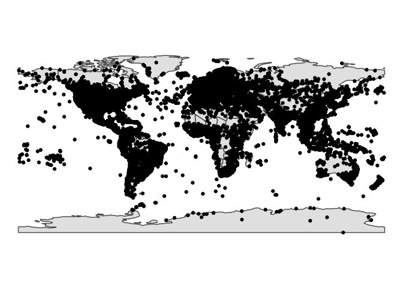
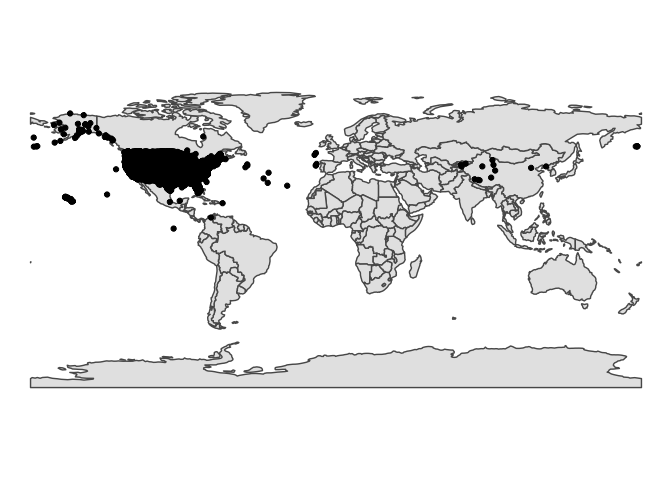

<!-- README.md is generated from README.Rmd. Please edit that file -->

# unlocodeR

<!-- badges: start -->

[](https://www.tidyverse.org/lifecycle/#experimental)
[](https://CRAN.R-project.org/package=unlocodeR)
<!-- badges: end -->

The goal of unlocodeR is to provide access for the UN Code for Trade and
Transport Locations for geospatial standardization as well as associated
tables for translating codes. This is an excellent classification that
gets at lower level geographic entities that states or provinces - such
as cities, railroad stations, airports, and more. See
<http://www.unece.org/cefact/codesfortrade/codes_index.html/> for much
more detail about the standard, as well as the docs here.

## Installation

<!--
You can install the released version of unlocodeR from [CRAN](https://CRAN.R-project.org) with:

``` r
install.packages("unlocodeR")
```
-->

``` r
remotes::install_github("jebyrnes/unlocodeR")
```

## The Data

``` r
library(unlocodeR)

head(unlocode)
#>   un_locode               name            name_en iso_3166_2_country
#> 1    AD ALV   Andorra la Vella   Andorra la Vella                 AD
#> 2    AD CAN            Canillo            Canillo                 AD
#> 3    AD ENC             Encamp             Encamp                 AD
#> 4    AD ESC Escaldes-Engordany Escaldes-Engordany                 AD
#> 5    AD EAC           Esc\xe0s              Escas                 AD
#> 6    AD FMO  La Farga de Moles  La Farga de Moles                 AD
#>   subdivision iata_code function_code status_code date latitude longitude     
#> 1        <NA>      <NA>      --34-6--          AI 0601  42 30 N  001 31 E <NA>
#> 2        <NA>      <NA>      --3-----          RL 0307  42 34 N  001 35 E <NA>
#> 3        <NA>      <NA>      --3-----          RL 0307  42 32 N  001 34 E <NA>
#> 4        <NA>      <NA>      --3-----          RL 0307  42 31 N  001 33 E <NA>
#> 5          04      <NA>      --3-----          RL 1407  42 33 N  001 31 E <NA>
#> 6        <NA>      <NA>      --3----B          RQ 0307     <NA>      <NA> <NA>
#>   latitude_dec longitude_dec
#> 1      42.5000        1.5167
#> 2      42.5667        1.5833
#> 3      42.5333        1.5667
#> 4      42.5167        1.5500
#> 5      42.5500        1.5167
#> 6           NA            NA
```

## Coverage

While some of the lat/longs are NA and some might be a hair off due to
manual correction of bad entries, spatial coverage is fairly good.

``` r
library(unlocodeR)
library(sf)
#> Linking to GEOS 3.7.2, GDAL 2.4.2, PROJ 5.2.0
library(dplyr)
#> 
#> Attaching package: 'dplyr'
#> The following objects are masked from 'package:stats':
#> 
#>     filter, lag
#> The following objects are masked from 'package:base':
#> 
#>     intersect, setdiff, setequal, union
library(ggplot2)
library(rnaturalearth)

unsf <- unlocode %>%
  filter(!is.na(latitude_dec)) %>%
  filter(latitude_dec < 180,
         abs(longitude_dec) < 180) %>%
  st_as_sf(coords = c("longitude_dec", "latitude_dec"), crs=4326)

ggplot() +
  geom_sf(data = ne_countries(returnclass = "sf")) +
  geom_sf(data = unsf) +
  theme_void()
```



Here it is for the US, for example

``` r
uslocode <- unlocode %>%
  filter(iso_3166_2_country=="US")


ggplot() +
  geom_sf(data = ne_countries(returnclass = "sf")) +
  geom_point(data = uslocode, aes(x = longitude_dec, y = latitude_dec)) +
  theme_void()
#> Warning: Removed 6967 rows containing missing values (geom_point).
```


